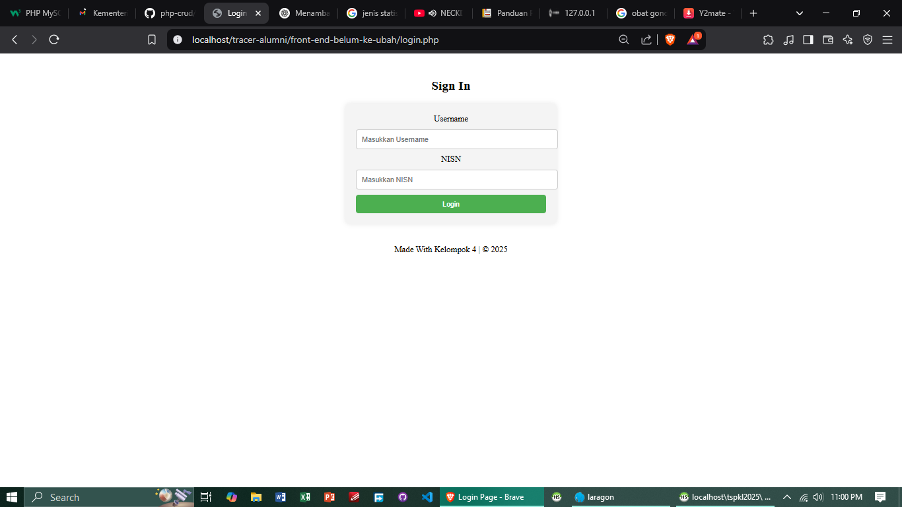
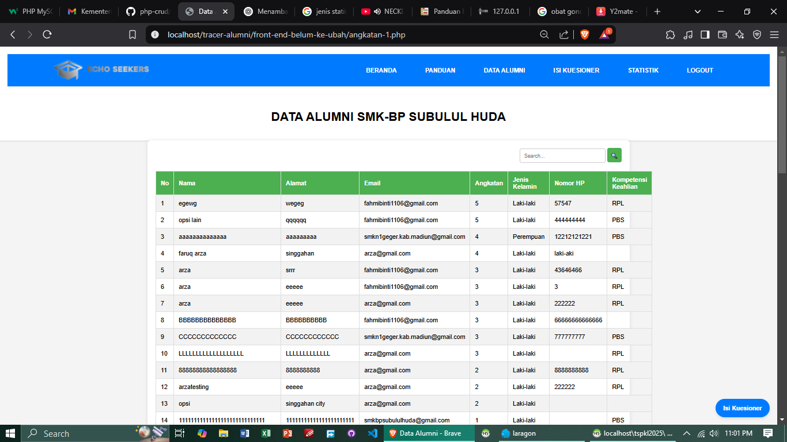
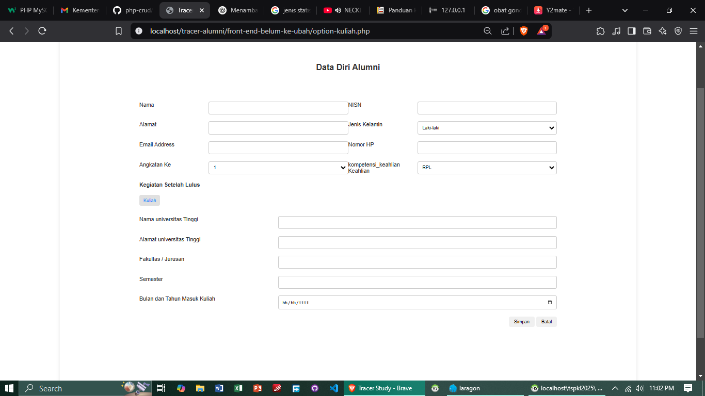
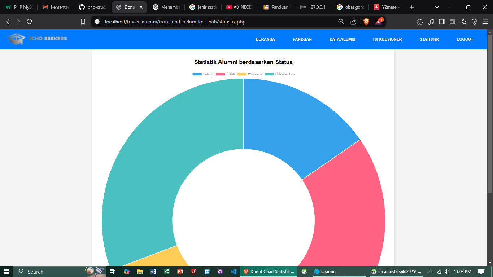

# Panduan Pengguna
Panduan Penggunaan Aplikasi Tracer Study Siswa SMKBP Subulul Huda
Panduan ini menjelaskan langkah-langkah dalam menggunakan aplikasi Tracer Study Siswa, baik untuk admin sekolah maupun alumni.

***1. Akses Aplikasi***

Buka browser (Google Chrome, Mozilla Firefox, Microsoft Edge).
Masukkan alamat aplikasi di URL, contoh:
cpp
Salin
Edit
http://127.0.0.1:8000/
(Jika sudah di-hosting online, gunakan URL resmi aplikasi.)
Login dengan akun yang sesuai:
menggunakan akun yang diberikan oleh sekolah atau daftar sendiri jika fitur registrasi aktif.

***2. Panduan untuk Alumni***

a. Login menggunakan Username dan NISN yang telah terdaftar.    Lalu pengguna akan dialihkan ke beranda utama. Di aplikasi ini terdapat 5 menu, yakni beranda, panduan pengguna, data alumni, dan statistik

b. Pilih menu panduan pengguna dan ikuti langkah-langkahnya,sentuh link di panduan
.png>)
c. Masuk halaman data alumni dan lihatlah riwayat alumni yang telah lulus dari SMK.

d. Masuk halaman isi kuesioner lalu isi data pribadi dan yang tersedia, seperti:
Status pekerjaan (Bekerja, Wirausaha, Kuliah, dll.), Nama perusahaan/kampus dan posisi/jurusan.
Relevansi pendidikan dengan pekerjaan saat ini.

e. Klik "Simpan" setelah selesai mengisi data kuesioner.

f. Masuk halaman statistik, di menu ini terdapat presentase status para alumni saat ini.

***3. Panduan untuk Admin Sekolah***

a. Login menggunakan username & NISN admin.

b. Pilih menu Data Alumni.  lalu Klik "Edit" untuk memperbarui data alumni. Klik "Hapus" jika perlu menghapus data tertentu.    dan "Tambah" untuk menambah alumni.

c. Menerima laporan dari Statistik hasil pengisian kuesioner.   Lihat statistik alumni berdasarkan
presentase status saat ini.

***4. Logout dan Keamanan Akun***

Klik "Logout" setelah selesai menggunakan aplikasi.
Jangan bagikan username dan password kepada orang lain untuk menghindari penyalahgunaan akun.
### ⬇⬇⬇☜(ﾟヮﾟ☜)  
[Lanjut](05.md){ .md-button .md-button--primary }